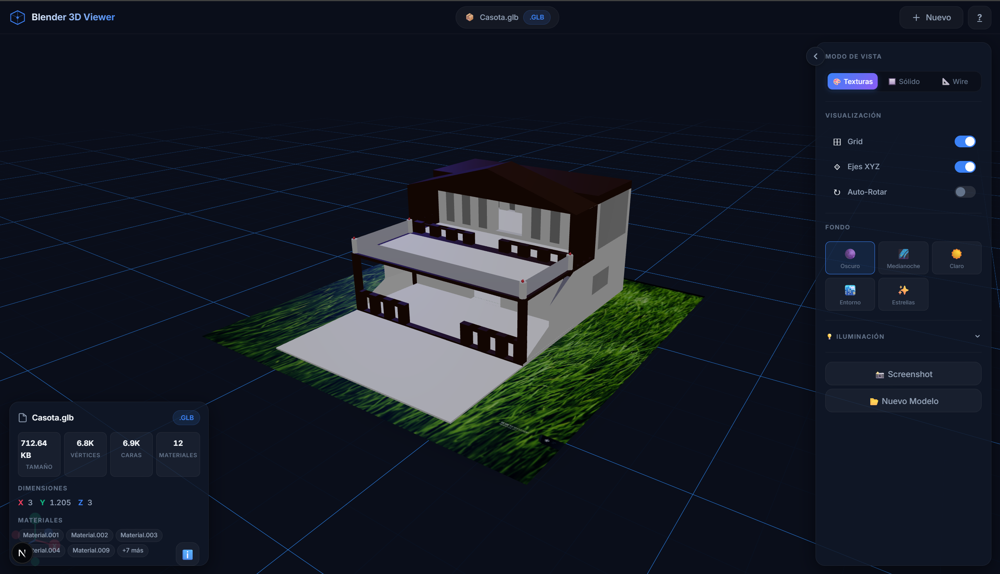
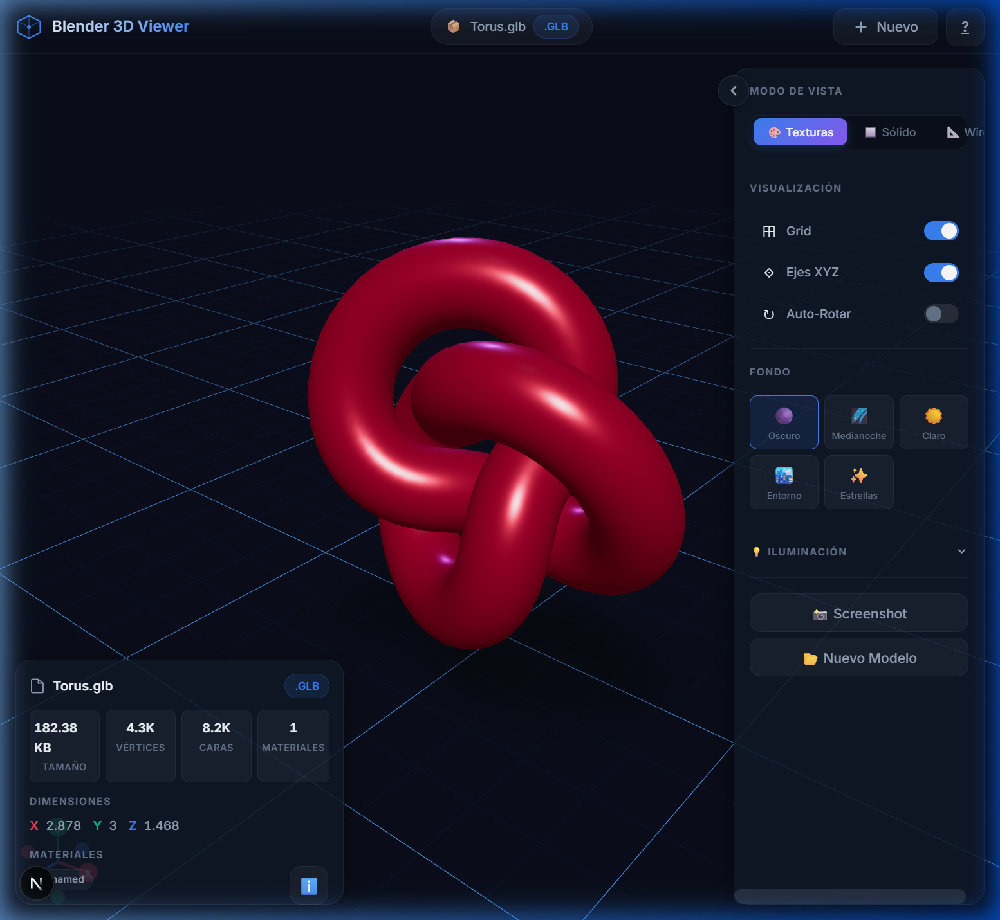
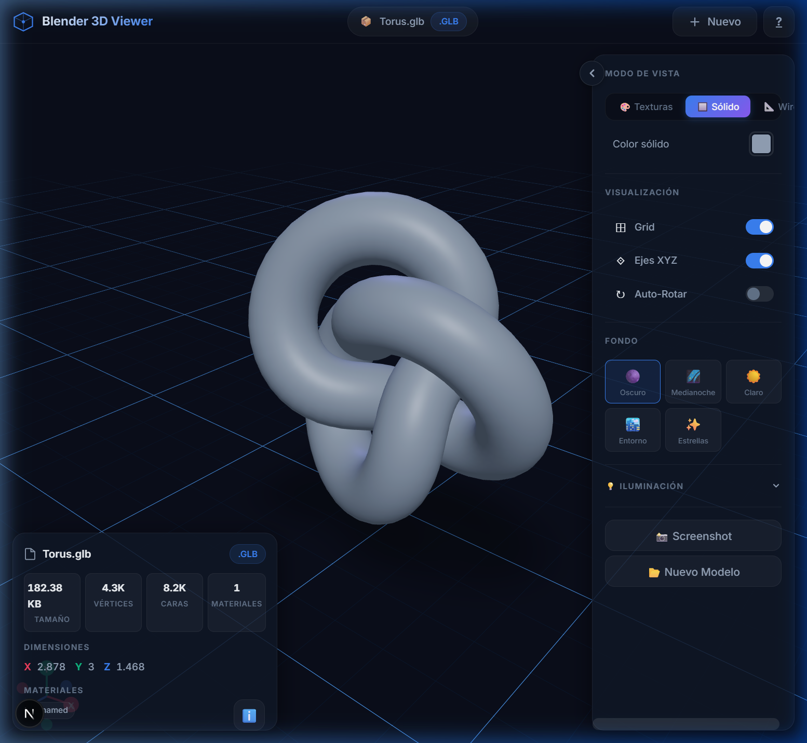
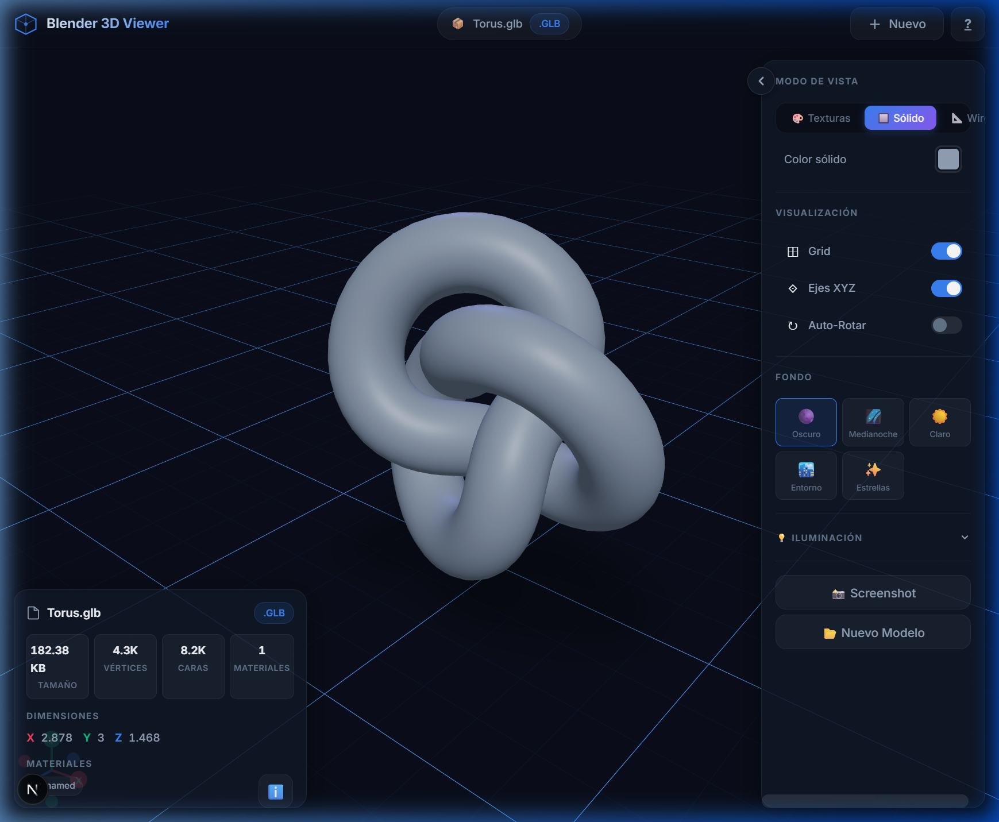
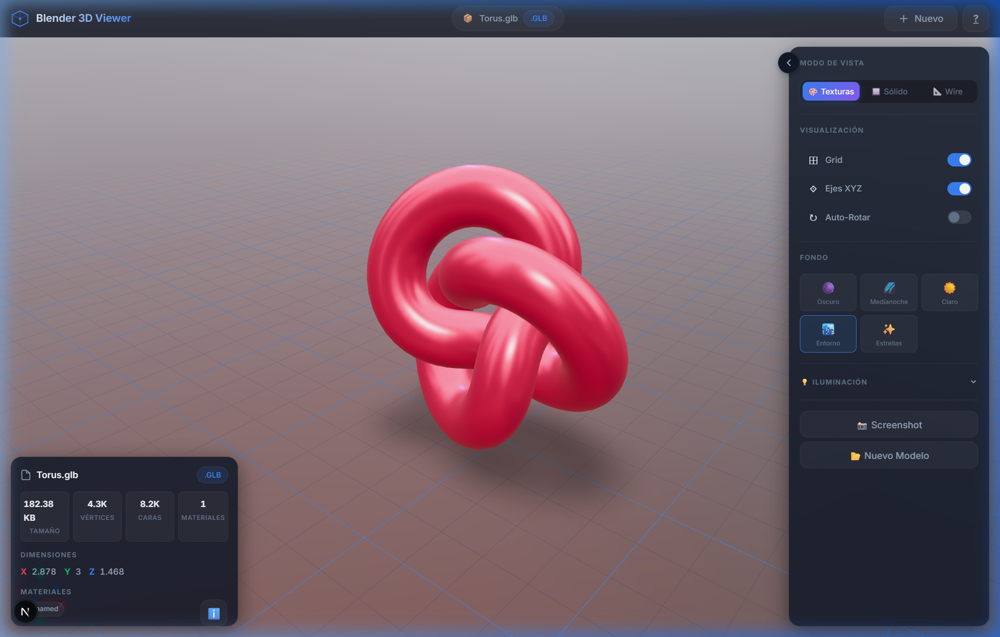
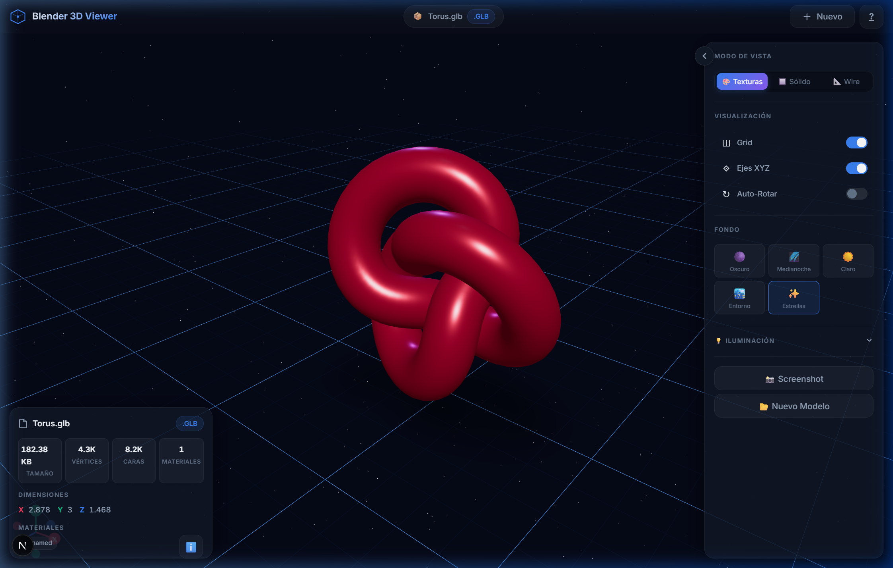
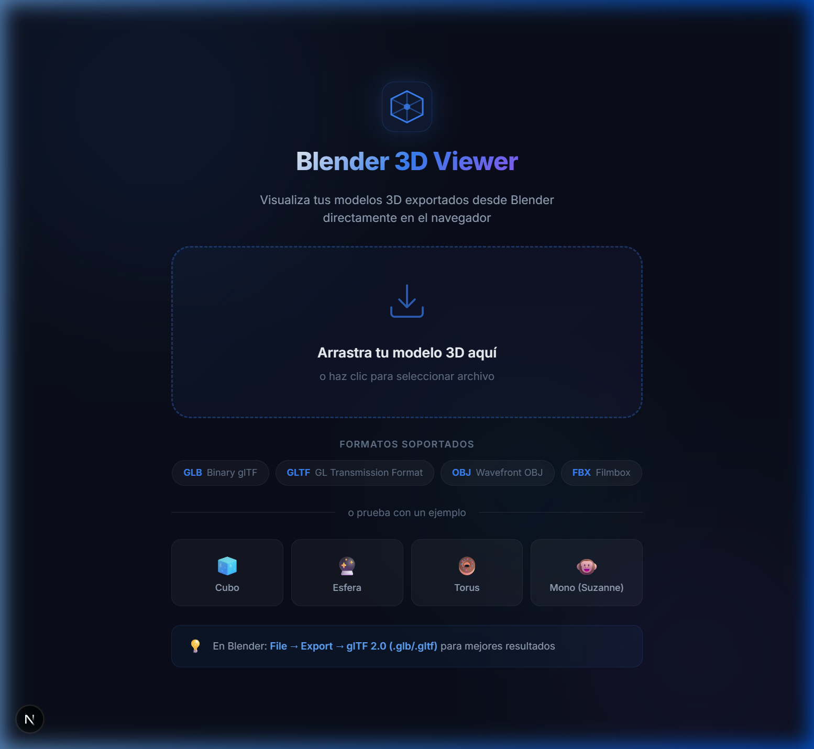
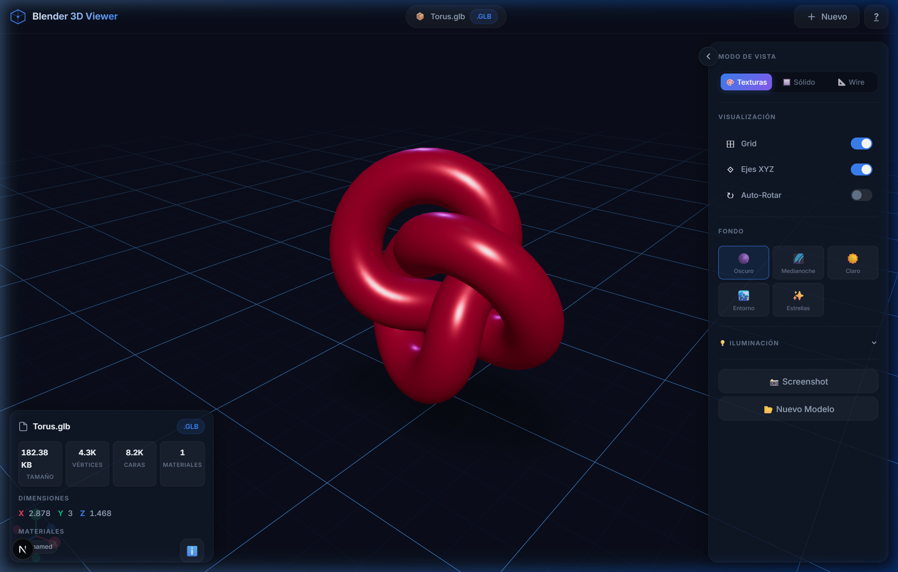
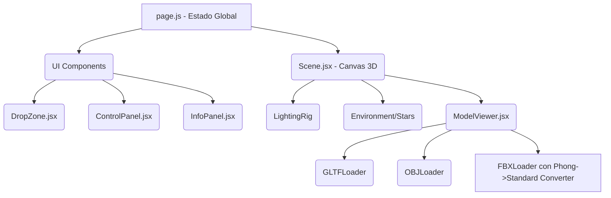

# 🧊 Blender 3D Viewer

Un potente visualizador de modelos 3D construido con **Next.js**, **React Three Fiber** y **Three.js**. Permite visualizar y explorar de forma interactiva modelos 3D exportados desde Blender (formatos GLB, GLTF, OBJ, y FBX) directamente en el navegador con un diseño premium *glassmorphism*.

---

## ✨ Características Principales

*   **Soporte Multiformato:** Carga modelos exportados desde Blender en formatos `.glb`, `.gltf`, `.obj` y `.fbx` (incluyendo la correcta conversión de materiales de Blender Phong a PBR Standard preservando colores y texturas).
*   **Modos de Visualización:**
    *   🎨 **Texturas:** Renderizado completo con materiales PBR.
    *   🔲 **Sólido:** Modelo con color uniforme (personalizable) para evaluar geometría.
    *   📐 **Wireframe:** Malla alámbrica para visualizar la topología del modelo.
*   **Iluminación Personalizable:** Ajusta la intensidad de la luz ambiental, direccional, y el color de las luces.
*   **Entornos Dinámicos (Fondos):**
    *   Oscuro, Medianoche, Claro.
    *   **Entorno HDRI:** Reflejos realistas basados en un entorno de ciudad (ideal para metales).
    *   **Estrellas:** Entorno inmersivo espacial en 3D.
*   **Panel de Información en Tiempo Real:** Muestra la cantidad de vértices, caras, cantidad de materiales y las dimensiones exactas (X, Y, Z) del modelo cargado.
*   **Herramientas de Visor:**
    *   Giro, Zoom y Paneo fluidos.
    *   Auto-Rotación activable.
    *   Visualización de Grid y Ejes XYZ de referencia.
    *   Captura de Screenshot integrada (descarga lo que ves como PNG).

---

## 📸 Demostraciones y Capturas

### Flujo Completo y Funcionalidades


### Modelos Complejos y Exportaciones FBX
El visualizador incluye un conversor inteligente para modelos FBX exportados desde Blender, preservando la fidelidad de los materiales:


### Modos de Visualización

<div style="display: flex; gap: 10px; justify-content: space-between;">
  
  
  
</div>

### Entornos (HDR y Estrellas)

<div style="display: flex; gap: 10px; justify-content: space-between;">
  
  
</div>

### Interfaz Principal y Panel de Control

<div style="display: flex; gap: 10px; justify-content: space-between;">
  
  
</div>

---

## 🛠️ Stack Tecnológico

*   **Framework:** [Next.js 16](https://nextjs.org/) (App Router)
*   **Lenguaje:** JavaScript (React)
*   **3D Engine:** [Three.js](https://threejs.org/)
*   **React Integration:** [@react-three/fiber](https://docs.pmnd.rs/react-three-fiber/)
*   **Ecosistema 3D:** [@react-three/drei](https://github.com/pmndrs/drei) (OrbitControls, Environment, Grid, ContactShadows)
*   **Estilos:** CSS Modules + Variables CSS puras (Diseño Glassmorphism)
*   **Iconos:** Lucide React

---

## 🏗️ Arquitectura del Proyecto

El flujo de renderizado 3D utiliza SSR deshabilitado (mediante `next/dynamic`) para evitar errores de hidratación de WebGL en el servidor:



### Conversión FBX / Materiales
Una de las innovaciones principales es el algoritmo en `ModelViewer.jsx` que intercepta materiales `MeshPhongMaterial` provenientes de exportaciones FBX de Blender y los mapea a `MeshStandardMaterial` para garantizar la compatibilidad PBR e impedir que el render parezca sobre-expuesto.

---

## 🚀 Instalación y Uso

### Prerrequisitos
- Node.js 18.x o superior
- npm o yarn

### Pasos

1. **Clonar el repositorio:**
   ```bash
   git clone https://github.com/FelipeEstrellaPro/blender-viewer.git
   cd blender-viewer
   ```

2. **Instalar dependencias:**
   ```bash
   npm install
   ```

3. **Iniciar el servidor de desarrollo:**
   ```bash
   npm run dev
   ```

4. **Abrir en el navegador:**
   Visita `http://localhost:3000`.

### Exportar desde Blender
Para obtener los mejores resultados, se recomienda:
1. Exportar como **glTF 2.0 (.glb)** (incluye geometrías, luces, cámaras y materiales).
2. Si usas **FBX**, asegúrate de incrustar las texturas (Path Mode: Copy, Embed Textures marcado).

---

## 📜 Licencia

Desarrollado bajo licencia MIT. Puedes usarlo, modificarlo y distribuirlo libremente.
